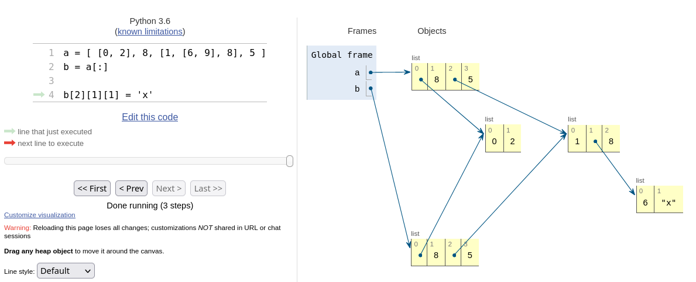

# Argomenti per lezione

## Lezione 1 del 2021-10-12

Introduzione al corso. Metodo algoritmico. Esempi: Rompicapo di Guarini; Calcolo della radice quadrata.

[Video della lezione](https://www.dropbox.com/s/q511d12dlj5yzl0/20211012-lezione_1.mp4?dl=1)

## Lezione 2 del 2021-10-14

Dall'algoritmo al programma. Programmi e macchine. Linguaggi di programmazione. Introduzione al linguaggio Python. L'interprete. La console. Installare Python. Spyder. Il primo programma.

[Video della lezione](https://www.dropbox.com/s/ne9a530s9uscmmm/20211014-lezione_2.mp4?dl=1)

## Lezione 3 del 2021-10-19

I tipi di dato **int** e **float**. Operazioni aritmetiche. Variabili e l'operatore di assegnamento. Operatori relazionali. Il tipo di dato **bool**. Operatori logici. Cicli **while**.

[Video della lezione](https://www.dropbox.com/s/q41q30r606sp714/20211019-lezione_3.mp4?dl=1)

## Lezione 4 del 2021-10-21

Ramificazione del flusso con **if**, **else**, **elif**. L'argomento **end** della funzione **print**(). Cicli annidati. *Esempio*: Disegno su console di un rettangolo con un determinato numero di righe e colonne. *Esercizio*: Modificare l'esempio precedente in modo da disegnare  solo il perimetro del rettangolo.

[Video della lezione](https://www.dropbox.com/s/of8ylp634ic9rpg/20211021-lezione_4.mp4?dl=1)

## Lezione 5 del 2021-10-26

Soluzione dell'esercizio proposto nella lezione precedente. Le stringhe: le funzioni **len**() e **input**(); indicizazione; confronto e odinamento lessicografico . Conversioni di tipo: le funzioni **int**(), **float**(), **str**(). Gestione delle eccezioni con **try**... **except**. *Esercizio*: Scrivere un programma che chiede in input una stringa e  stampa *Vero* se questa è palindroma, *Falso* altrimenti.

[Video della lezione](https://www.dropbox.com/s/338iss952klr2mz/20211026-lezione_5.mp4?dl=1)

## Lezione 6 del 2021-10-28

Soluzione dell'esercizio proposto nella lezione precedente. Le stringhe: gli operatori + (concatenazione), * (ripetizione), **in** (appartenenza) . Il ciclo **for** e la funzione **range**(). *Esercizio 1*: modificare il programma trova_minuscole.py in modo che identificare con tre simboli diversi le lettere maiuscole, minuscole ed i caratteri numerici. *Esercizio 2*: Scrivere un programma che chiede in input due stringhe e, se queste hanno una lettera in comune, mostri le due stringe una in orizzontale e l'altra in verticale incrociandole sulla lettera in comune.

[Video della lezione](https://www.dropbox.com/s/lzdbsixz4p2ankt/20211028-lezione_6.mp4?dl=1)

## Lezione 7 del 2021-11-02

Soluzione dell'esercizio proposto nella lezione precedente. Le stringhe: indici negativi e slicing. *Esercizio*: Scrivere un programma che chiede in input due stringhe *a* e *b*. Se *b* e' sottostringa di *a* il programma stampa la posizione di *a* a partire da cui compare *b*. Altrimenti il programma deve stampare -1. Ad esempio se *a* e' la stringa 'rinoceronte' e *b* e' la stringa 'noce', il programma deve stampare 2. 

[Video della lezione](https://www.dropbox.com/s/robfszlwbclth7a/20211102-lezione_7.mp4?dl=1)

## Lezione 8 del 2021-11-04

Soluzione dell'esercizio proposto nella lezione precedente. Le stringhe: approfondimento su slicing, immutabilità delle stringhe. *Esercizio*: Scrivere un programma che chiede in input due numeri *x* e *y* e stampa la radice quadrata di *x* sommata alla radice quadrata di *y*. È proibito utilizzare l'operatore `**`.

[Video della lezione](https://www.dropbox.com/s/9p5er7sskuorqdl/20211104-lezione_8.mp4?dl=1)

## Lezione 9 del 2021-11-09

Soluzione dell'esercizio proposto nella lezione precedente. Le funzioni in Python: definizione; parametri formali; invocazioni; flusso del programma; parametri con valori di default.. Stringhe: slicing con step positivo e negativo.. *Esercizio*: Scrivere una funzione che prende in input una stringa e restituisce *True* se questa è palindroma, *False* altrimenti.

[Video della lezione](https://www.dropbox.com/s/iieowwc1kb63ulr/20211109-lezione_9.mp4?dl=1)

**ERRATA**: Al minuto 1:19, 1**-12 non è 0.0.....1 ma 1.0 Avrei dovuto mettere 10**-12. Questo spiega perché l'approssimazione calcolata per questo valore è pessima.

## Lezione 10 del 2021-11-11

Soluzione dell'esercizio proposto nella lezione precedente. Algoritmi per il calcolo della funzione logaritmo: ricerca esaustiva, ricerca per bisezione. *Esercizio*: Scrivere una funzione che dato *x*, *b* e *err*, restituiesce un'approssimazione, data da *err*, del logaritmo in base *b* di *x*. La funzione deve usare per i parametri *b* e *err* rispettivamente i valori di default 10 e 0.0001.

[Video della lezione](https://www.dropbox.com/s/cd96dhqpiymwip4/20211111-lezione_10.mp4?dl=1)

### Addendum

*Esercizio*: Scrivere una funzione per il calcolo della radice quadrata che faccia uso della stessa tecnica utilizzata per la funzione logaritmo. La funzione, chiamata *radice_per_bisezione*, deve prendere in input *x* e *err* e deve restituire la radice quadrata di *x* utilizzando *err* come parametro per la valutazione della qualità  dell'approssimazione. Rispetto alla funzione *sqrt* mostrata nella lezione 9 del 9 novembre, quale converge prima?  

## Lezione 11 del 2021-11-16

Soluzione degli esercizi proposti nella lezione precedente. Funzioni che restituiscono più risultati. Le *tuple*: definizione, indicizzazione, slicing, lunghezza, concatenazioni, ripetizione, iterazione. Funzioni che prendono un numero variabile di argomenti.

[Video della lezione](https://www.dropbox.com/s/mt1mu6n8zz1mj49/20211116-lezione_11.mp4?dl=1)

## Lezione 12 del 2021-11-18

Funzioni: argomenti per nome; *stack frame*;  visibilità delle variabili. Funzioni ricorsive.  *Esercizio*: scrivere una funzine ricorsiva che restituisce True se e solo se la stringa in input è palindroma.

[Video della lezione](https://www.dropbox.com/s/m4aevm60zzikps0/20211118-lezione_12.mp4?dl=1)

## Lezione 13 del 2021-11-23

Funzioni ricorsive: correzione esercizio. *Esercizio*: vedere notebook della lezione.

[Video della lezione](https://www.dropbox.com/s/vad4kj0k9ikhl68/20211123-lezione_13.mp4?dl=1)

## Lezione 14 del 2021-11-25

Soluzione dell'esercizio della lezione precedente. Il tipo **None**. La funzione **help**() e le *docstring*. Metodi. Le *liste*: definizione; indicizzazione, slicing, iterazione, appartenenza; concatenazione e ripetizione; assegnazione di item; metodi *append* e *insert*. *Esercizio*: scrivere un programma che, data una lista contenente numeri, porta il valore massimo in ultima posizione e gli altri elementi nelle posizioni precedenti.

[Video della lezione](https://www.dropbox.com/s/sshb3bam1crzinr/20211125-lezione_14.mp4?dl=1)

## Lezione 15 del 2021-11-30

Soluzione dell'esercizio della lezione precedente. Liste come argomenti di funzione; *alias* e *clonazione* di liste; impacchettamento e spacchettamento di tuple e liste.

[Video della lezione](https://www.dropbox.com/s/7bqfuoxiux5iee7/20211130-lezione_15.mp4?dl=1)

## Lezione 16 del 2021-12-02

L'operatore di assegnamento su liste (*aliasing*). L'algoritmo di ordinamento *bubble-sort*: descrizione e implementazione in python.

[Video della lezione](https://www.dropbox.com/s/h6rnafnko9b3y3a/20211202-lezione_16.mp4?dl=1)

### Esercizi

**1**: Il bubble-sort, così come lo abbiamo implementato a lezione a partire dalla seconda scansione in poi esegue un numero crescente di confronti inutili in quanto gli elementi più grandi hanno già raggiunto la loro posizione finale nella lista. Modificare l'implementazione evitando questi confronti inutili.

**2**: Supponiamo che la lista *a* contenga liste annidate, l'operazione di copia tra liste con slicing si limita a clonare la lista principale (radice) creando 
alias per le liste annidate. 

(La figura mostra uno screenshot di [Python Tutor](https://pythontutor.com/) raffigurante lo stato delle variabili dopo una operazione di clonazione e di assegnamento ad un elemento di una lista annidata).

Scrivere una funzione Python denominata *deep_copy* che clona la lista in input e tutte le liste annidate che essa contiene.

*Suggerimento*. Ci si ispiri alla funzione *conta_elem_tna* descritta nella [Lezione 14](https://github.com/glucatv/Programmazione-dei-Calcolatori-aa21-22/tree/main/20211125-lezione_14).

## Lezione 17 del 2021-12-07

Soluzione degli esercizi della lezione precedente (ottimizzazione di *bubble_sort* e funzione *deep_copy*). La funzione **id**(). Le funzioni sono dati: funzioni come argomenti di funzione. Come rendere generale la funzione bubble_sort tramite l'introduzione di una funzione di confronto come secondo parametro.

[Video della lezione](https://www.dropbox.com/s/epi32gxgopac1bc/20211207-lezione_17.mp4?dl=1)

### Esercizio

**Ordinamento multi-criterio** La lista *a* è composta da numeri e stringhe, si vogliono ordinare gli elementi di *a* in modo che: 

1. i numeri precedano le stringhe
2. i numeri siano ordinati dal più piccolo al più grande
3. le stringhe siano ordinate da quella più corta a quella più lunga

Progettare ed implementare una opportuna funzione di confronto da utilizzare con la lunzione *bubble_sort*

## Lezione 18 del 2021-12-09

Soluzione degli esercizi della lezione precedente (ordinamento bi-criterio con *bubble_sort* ed opportuna funzione di confronto). Implementazione della funzione bubble-sort con *key*-function definire il criterio di ordinamento. Confronto tra sequenza (negli esempi sono tuple)

[Video della lezione](https://www.dropbox.com/s/lfheptv98m8qra3/20211209-lezione_18.mp4?dl=1)

### Esercizio 1

**Ordinamento multi-criterio 2** La lista *a* è composta da numeri e stringhe, si vogliono ordinare gli elementi di *a* in modo che: 

1. i numeri precedano le stringhe
2. i numeri siano ordinati dal più piccolo al più grande
3. le stringhe siano ordinate da quella più corta a quella più lunga

Progettare ed implementare una opportuna *key*-function da utilizzare con la lunzione *bubble_sort*

### Esercizio 2

**Ordinamento invertito** Dopo aver risolto il precedente esercizio, modificare la funzione in modo che sia compreso un terzo parametro, chiamato *reverse*, di tipo **bool** che di default deve essere **False**. In caso questo sia **True** l'ordinamento deve essere invertito rispetto al criterio indotto alla **key**-function.

Ad esempio dopo

	a = ['zero', 'uno', 'due', 'tre', 'quattro']
	bubble_sort(a, k = len, reverse = True) 
	
la lista diventa

	['quattro', 'zero', 'uno', 'due', 'tre']

## Lezione 19 del 2021-12-14

Soluzione degli esercizi della lezione precedente. Tempo e spazio come risorse di calcolo; costo computazionale dei programmi; conteggio del numero di istruzioni elementari; numero di istruzioni in funzione dell'input.

[Video della lezione](https://www.dropbox.com/s/7egf370k0om07js/20211214-lezione_19.mp4?dl=1)

## Lezione 20 del 2021-12-16

Complessià computazione, analisi del caso peggiore (worst case) in funzione della dimensione dell'input, notazione asintotica (*O*-grande).

[Video della lezione](https://www.dropbox.com/s/7sp1sajpt49hyqj/20211216-lezione_20.mp4?dl=1)

### Esercizio

Si progetti ed implementi in Python una funzione denominata *intersezione* che prende in input due liste *a* e *b* e restituisce una terza lista, diciamo *c*, contenente tutti gli elementi che sono sia in *a* che in *b*. La lista *c* non deve avere elementi ripetuti. Dopo aver implementato la funzione se ne calcoli il costo computazionale.

## Lezione 21 del 2021-12-21

Soluzione dell'esercizio della lezione precedente. Costi degli operatori e dei metodi sulle liste. La struttura dati **set**, gli operatori e il loro costo computazionale.

[Video della lezione](https://www.dropbox.com/s/whg62j8swrpskpe/20211221-lezione_21.mp4?dl=1)

## Lezione 22 del 2021-12-23

La struttura dati dizionario: definizione, operatori, metodi e costi computazionali.

[Video della lezione](https://www.dropbox.com/s/z7blwdunqo01nte/20211223-lezione_22.mp4?dl=1)

### Esercizi

**1)** Sia `a` una lista lunga `n`, scrivere un programma che chiede all'utente di digitare `m` stringhe e per ognuna di queste il programma deve stampare quante volte compare in `a` ed in che posizione si trova l'ultima occorrenza (se il numero di occorrenze è >0). Il costo della soluzione deve essere `O(n+m)`.

**2)** Scrivere una funzione denominata *inverti_dizionario* che prende in input un dizionario `d` e restituisce un dizionario `d_inv` che ha per chiavi i valori in `d` e `d_inv[v]` è la lista di chiavi che `d` mappa in `v`. Esempio se

	d = { 'k0': 'v0', 'k1': 'v1', 'k2': 'v0' }

allora

	d_inv = { 'v0': ['k0', 'k2'], 'v1': ['k1'] }

Calcolare il costo computazionale della soluzione prodotta.

**3)** Scrivere una funzione che prende due dizionari in input `a` e `b` e restituisce un terzo dizionario `c` che ha per chiavi tutte quelle in `a` che non sono in `b` e tutte quelle in `b` che non sono in `a`. I valori associati a queste chiavi devono essere quelli del dizionario di partenza. La funzione deve chiamarsi *differenza_simmetrica*. Esempio se

	a = {'k0': 'v0', 'k1': 'v1', 'k2': 'v0'}
	b = {'k1': 'v7', 'k2': 'v1', 'k3': 'v3'}

allora `differenza_simmetrica(a, b)` deve restituire

	{'k0': 'v0', 'k3': 'v3'}

Calcolare il costo computazionale della soluzione prodotta.

## Lezione 23 del 2022-01-11

Soluzione degli esercizi per casa.

[Video della lezione](https://www.dropbox.com/s/0y5ckas2lysb4n4/20220111-lezione_23.mp4?dl=1)

## Lezione 24 del 2022-01-13

Algoritmo di ricerca binaria: correttezza e costo computazionale. Esercizio: Vedere [notebook](20220113-lezione_24/ricerca_binaria.ipynb).
 
[Video della lezione](https://www.dropbox.com/s/m1hn9v0gzilmv0m/20220113-lezione_24.mp4?dl=1)

## Lezione 25 del 2022-03-10

Applicazione della ricerca binaria per contare il numero di elementi minori o uguali ad uno dato in una lista ordinata (ovvero la soluzione dell'esercizio proposto nella lezione precedente). Le funzioni `all` e `any` e la *comprensione di lista*

[Video della lezione](https://www.dropbox.com/s/tixfj65sfxh0aeo/20220310-lezioni_25.mp4?dl=1)

## Lezione 26 del 2022-03-11

L'algoritmo *merge* per fondere due liste già ordinate in un unica lista ordinata: descrizione; correttezza, implementazione e costo computazionale. L'algoritmo *merge sort*: descrizione; correttezza e costo computazionale.

[Video della lezione](https://www.dropbox.com/s/62nohqiejiux2sn/20220311-lezione_26.mp4?dl=1)

## Lezione 27 del 2022-03-17

L'algoritmo di ordinamento per fusione *merge sort*: implementazione e implicazioni sul costo in base alle interazioni con la fuzione `merge`. Introduzione al linguaggio di programmazione C: differenza tra linguaggi interpretati e compilati.

[Video della lezione](https://www.dropbox.com/s/xuwnyi9q7ozglm9/20220317-lezione_27.mp4?dl=1) 

## Lezione 28 del 2022-03-18

Introduzione al linguaggio di programmazione C: editig e compilazione; la funzione `main`; variabili; tipi `int`, `float`, `char` e stringhe; la funzione `printf`; cicli `while`; funzioni e tipi di ritorno; il tipo `void`.

[Video della lezione](https://www.dropbox.com/s/rzptk134dldgxoa/20220318-lezione_28.mp4?dl=1) 

## Lezione 29 del 2022-03-24

Ruolo e significato della variabili in C e differenze con Python. Operatori aritmetici e relazionali. Conversioni di tipo implicito ed esplicito (casting). Definizione di funzioni.

[Video della lezione](https://www.dropbox.com/s/m81ugowyk15suao/20220324-lezione_29.mp4?dl=1)

## Lezione 30 del 2022-03-25

*Dichiarazioni* e definizioni delle funzioni, il ruolo del *prototipo* di funzione nel processo di compilazione. La funzione nella compilazione dell'operazione di inclusione (`#include`) dei *file di intestazione* (.h) o *header*. Descrizione schematica del processo di compilazione: *precompilazione*; *compilazione*; *linking*. Compilazione di un programma diviso su più file, esempio

    gcc lezione30.c nep.c
    
Sequenze in C, gli **array**: definizione; array come argomenti di funzione.

[Video della lezione](https://www.dropbox.com/s/9jz3e4erildlp30/20220325-lezione_30.mp4?dl=1)

## Lezione 31 del 2022-03-31

Array e puntatori; la funzione `sizeof`; differenze tra array e puntatori; l'indirizzo `NULL`; le costanti e la direttiva `#define`; l'operatore `*` e l'aritmetica dei puntatori.

[Video della lezione](https://www.dropbox.com/s/tscci0ets3i4c1x/20220331-lezione_31.mp4?dl=1)

## Lezione 32 del 2022-04-01

L'operatore `&`; le lunzioni `malloc` e `free` della libreria `stdlib`; funzioni che creano e restituiscono array; primi cenni su come realizzare in C array dinamici.

[Video della lezione](https://www.dropbox.com/s/1dtp6tq0x7bptgf/20220401-lezione_32.mp4?dl=1)

## Lezione 33 del 2022-04-07

**Problema**: progettare una funzione che restituisce una stringa concatenando due stringhe di input. Approfondimenti sul tipo di dato `char`: la codifica *ASCII*. **Esercizio**: scrivere una funzione che prende in input una stringa e conta il numero di caratteri minuscoli che questa contiene.

[Video della lezione](https://www.dropbox.com/s/flf52jzmcj4kvqe/20220407-lezione_33.mp4?dl=1)

## Lezione 34 del 2022-04-08

Soluzione dell'esercizio proposto nella lezione precedente. Puntatori come argomenti delle funzioni: fare in modo che una funzioni modifichi variabili dichiarate esternamente. Una prima implementazione di array dinamico in C con una funzione `append` che aggiunge un elemento in fondo all'array.

**Esercizi**

1. Scrivere una funzione denominata `swap_cases` che prende in input una stringa e rende maiuscole le lettere minuscole e viceversa.
2. Scrivere una funzione denominata `slice` che prende una stringa `a` e due interi positivi `i` e `j` (si può assumere che `i<j`) e restituisce una stringa composta dai caratteri `a[i]`, `a[i+1]`,...`a[j-1]`. Si tratti il caso in cui `i` e `j` non definiscano indici validi di `a`, in tale evenienza la funzione deve restituire `NULL`.

[Video della lezione](https://www.dropbox.com/s/ejgmf1e85s2ozo8/20220408-lezione_34.mp4?dl=1)

## Lezione 35 del 2022-04-14

Correzione degli esercizi.

[Video della lezione](https://www.dropbox.com/s/9twf5205cedglwm/20220414-lezione35.mp4?dl=1)

## Lezione 36 del 2022-04-15

`struct` e `typedef`: definizioni; accesso ai campi con gli operatori `.` e `->`; l'operatore di assegnamento tra `struct`; `struct` come input o output di funzione. **Array dinamici**: definizione del nuovo tipo di dati e imlementazione delle funzioni `array_init`, `array_append` e `array_print`; costo computazione medio dell'operazione di append.

**Esercizi**

1. Scrivere una funzione denominata `array_insert` che prende in input i parametri `v`, `p`, `e` dove il primo è un `array_dinamico` (come definito a lezione), il secondo è un intero `p` ed il terzo un `float`. La funzione deve inserire `e` in posizione `p` di `v` e restituire l'array modificato. La funzione può assumere che `p` rappresenti una posizione valida di `v`. Qual è il costo medio dell'operazione?

2. Scrivere una funzione denominata `array_pop` che prende in input un array dinamico `v` ed elimina da `v` l'elemento in coda.

[Video della lezione](https://www.dropbox.com/s/0k0gmfz60d625cf/20220415-lezione_36.mp4?dl=1)

## Lezione 37 del 2022-04-21

Array dinamici: l'operazione `array_insert` (inserimento in posizione `p`) e l'operazione `array_pop` (rimozione dell'ultimo elemento dall'array); osservazioni sui costi. La funzione `realloc`.

[Video della lezione](https://www.dropbox.com/s/7le63z3tutslyk0/20220421-lezione_37.mp4?dl=1)

## Lezione 38 del 2022-04-22

Un meccanismo per gestire in C array con elementi di tipo diverso.

[Video della lezione](https://www.dropbox.com/s/wzq470kzi51jxdh/20220422-lezione_38.mp4?dl=1)

## Lezione 39 del 2022-04-28

Rappresentazione degli array in memoria; array a più dimensioni; costo computazionale dell'operazione di indicizzazione; rappresentazione di array a più dimensioni attraverso array ad una dimensione (conversione di indici); differenza tra array più dimensioni ed array di array.

[Video della lezione](https://www.dropbox.com/s/iz9bc3pxwzg2lek/20220428-lezione_39.mp4?dl=1)

## Lezione 40 del 2022-04-29

Definizione di una struttura dati `matrice` per matridi a due dimensioni. `Liste concatenate`: motivazioni, introduzione e una prima rappresentazione in C.

[Video della lezione](https://www.dropbox.com/s/bygwg9pwle7b21j/20220429-lezione_40.mp4?dl=1)

## Lezione 41 del 2022-05-05

Liste concatenate: funzioni per inserimento in testa e visita (stampa e ricerca); descrizioni, implementazioni e costo computazionale.

[Video della lezione](https://www.dropbox.com/s/yzexktpz35o4yjn/20220505-lezione_41.mp4?dl=1)

## Lezione 42 del 2022-05-06

Liste concatenate: funzione per inserimento in posizione generica e funzione di inserimento in coda; descrizioni, implementazioni e costo computazionale; descrizione delle funzioni di cancellazione.

**Esercizio**. Implementare in C le funzioni di cancellazione.

[Video della lezione](https://www.dropbox.com/s/48khgaqpmgggpot/20220506-lezione_42.mp4?dl=1)

## Lezione 43 del 2022-05-12

Liste concatenate: funzioni per la cancellazione di elementi dalla lista; lista di stringhe e problematiche relative all'utilizzo del puntatore nel campo `val` dell'elemento della lista. Passaggio degli argomenti alla linea di comando.

[Video della lezione](https://www.dropbox.com/s/f4hsxove3k0g0z6/20220512-lezione_43.mp4?dl=1)

## Lezione 44 del 2022-05-13

Liste concatenate: liste di stringhe, implementazione delle funzioni di cancellazione (esercizo, completare le implementazioni rimaste). La struttura dati `dizionario`: definizione e operatori; una possibile implementazione con liste concatenate e con array dinamici e costi computazionali; descrizione dell'implementazione attraverso array di liste e valutazione dei costi.

[Video della lezione](https://www.dropbox.com/s/h7wuwwxx9bql6ik/20220513-lezione_44.mp4?dl=1) 
